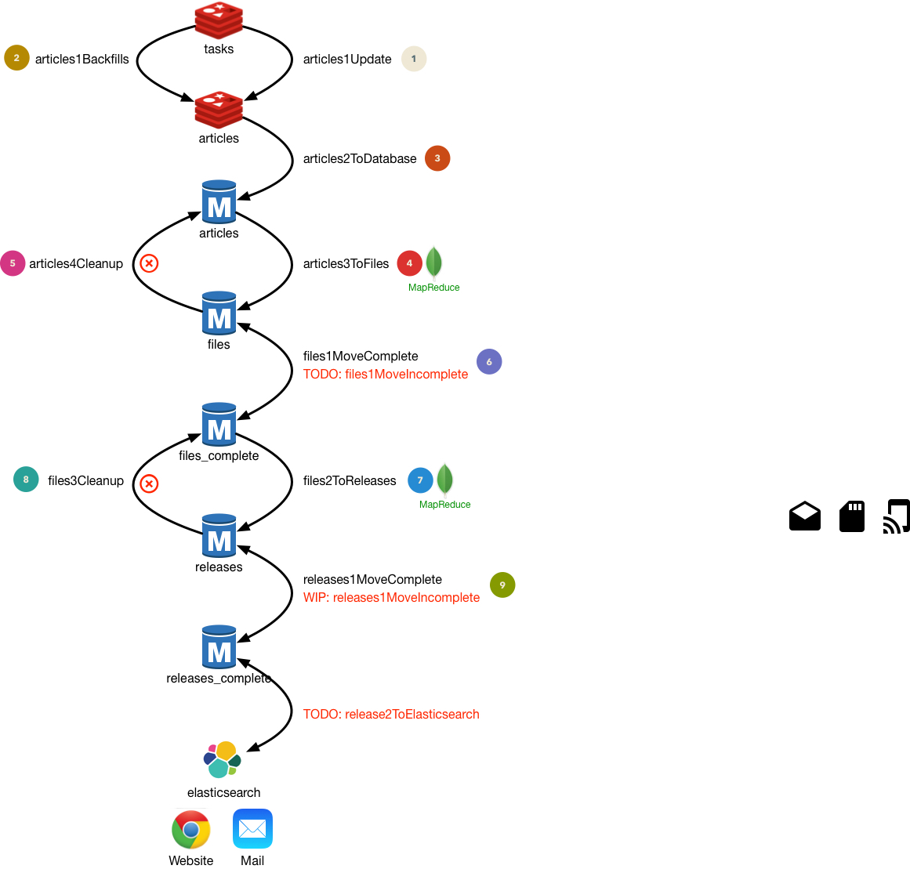

# This is pretty much in early stages still
## It works.... but performance could be better and it's missing some stuff to compile releases from incomplete files... no UI... no elasticsearch integration yet... if you want to help... lemme know ;-)
### Basic Instructions:
 1. clone repo
 1. npm install
 1. copy config.default.js --> config.js and modify your settings
 1. fire up redis and mongodb
 1. start running scripts (in order!)

# articles1: Update
## Fetch articles from newsgroup(s) to REDIS
- **Input**
	1. from CONFIG
		- articles_per_connection
		- total_articles
	1. from MONGODB
		- stats
- **Output**
	1. to REDIS
		- articles
	1. to MONGODB
		- stats
# articles2: ToDatabase
## Move articles from REDIS to MONGODB
- **Input**
	1. from REDIS
		- articles_per_connection
		- total_articles
- **Output**
	1. to MONGODB
		- Collection "articles"
# articles3: ToFiles
## MONGODB mapReduce from articles to files
- **Input**
	1. from MONGODB
		- lastrun (from stats)
		- articles
- **Output**
	1. to MONGODB
		- Collection "files" is **updated** with articles
		- lastrun us updated

https://stackedit.io/editor