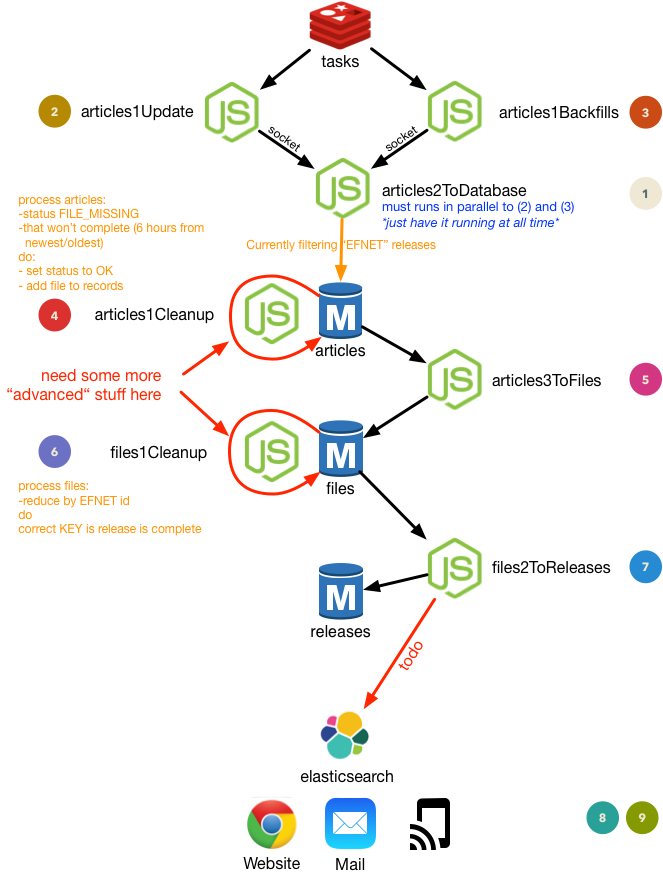
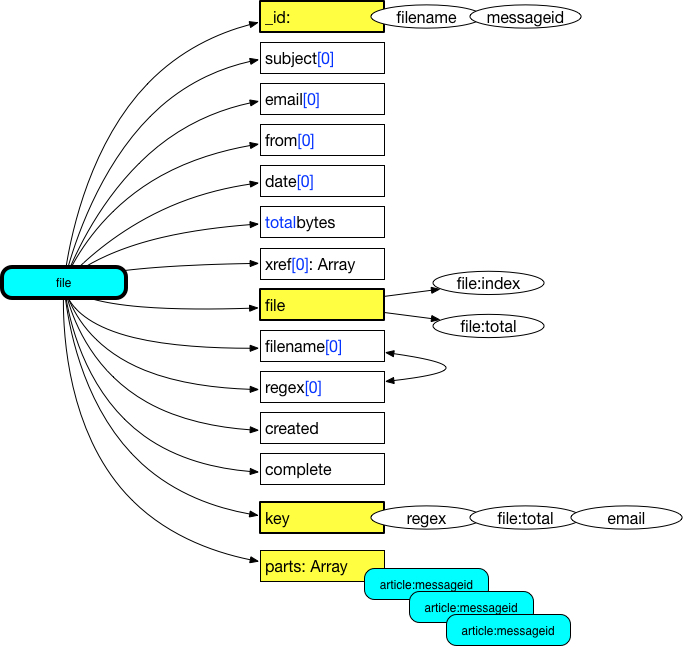
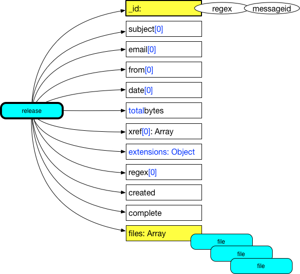

# This is pretty much in early stages still
## It works.... but performance could be better and it's missing some stuff to compile releases from incomplete files... no UI... no elasticsearch integration yet... if you want to help... lemme know ;-)
### Basic Instructions:
 1. clone repo
 1. npm install
 1. npm -g install ts-node bunyan
 1. copy config.default.ts --> config.ts and modify your settings
 1. fire up redis and mongodb
 1. run node createCollections.js
 1. start running scripts (nb: in order!)

**NB:** You definately wanna tweak (lower) the thread settings in config. I have dual-hexacore machine (12 physical cores). Its easy to take your machine to the limit with these volumes :-)
**NB:** If you run script and want proper output (I use bunyan for logging), you run them with the following command:

`ts-node articles1Update.ts  | bunyan`

~~### Added Scripts~~
~~`./update.sh`~~
~~`./backfill.sh`~~

### TODO / Plans (not necessarily in order):
 1. propagate all neccesary fields to releases
 1. improve incomplete detection / completion (for files, for releases its already getting there)
 1. ~~automate flow of execution of scripts~~
 1. integrate with elasticsearch
 1. make it work with a list of newsgroups (and accompanying handling of duplicates / crossposts)
 1. nzb file generation
 1. improve performance
 1. put a website on top
 1. automaticaly generate notifications (email / other) based on configurable search critera

## article object

## file object

## release object

### Last updates:
1. All scripts now exit properly
2. **Significantly** improved the performance of "articles2ToDatabase.js", blazing fast it is now

# articles1: Update
## Fetch (new) articles from newsgroup(s) to REDIS
- **Input**
	1. from CONFIG
		- articles_per_connection
		- total_articles
		- newsgroup
	1. from MONGODB
		- stats (previous run)
- **Output**
	1. to REDIS
		- articles
	1. to MONGODB
		- updated stats
# articles1: Backfill
## Fetch (backfill) articles from newsgroup(s) to REDIS
- **Input**
	1. from CONFIG
		- articles_per_connection
		- total_articles
		- newsgroup
	1. from MONGODB
		- stats (previous run)
- **Output**
	1. to REDIS
		- articles
	1. to MONGODB
		- stats
# articles2: ToDatabase
## Move articles from REDIS to MONGODB
### This is where the parsing of the articles is performed
#### This is too slow!
- **Input**
	1. from REDIS
		- articles
- **Output**
	1. to MONGODB
		- Collection "articles"
# articles3: ToFiles
## MONGODB mapReduce from articles to files
#### This is too slow!
- **Input**
	1. from MONGODB
		- lastrun (from stats)
		- articles
- **Output**
	1. to MONGODB
		- Collection "files" is **updated** with articles
		- lastrun is updated
# articles4: Cleanup
## MONGODB clean articles
#### This is too slow!
- **Input**
	1. from MONGODB
		- Collection "files"
- **Output**
	1. to MONGODB
		- Clean collection "articles"
# files1: Move Complete
## MONGODB move complete files
- **Input**
	1. from MONGODB
		- Collection "files"
- **Output**
	1. to MONGODB
		- Collection "files_complete"
# files2: ToReleases
## MONGODB mapReduce from files_complete to releases
- **Input**
	1. from MONGODB
		- Collection "files_complete"
- **Output**
	1. to MONGODB
		- Collection "releases" is **updated** with files
# files3: Cleanup
## MONGODB clean files
- **Input**
	1. from MONGODB
		- Collection "release"
- **Output**
	1. to MONGODB
		- Clean collection "files_complete"
# releases1: Move Complete
## MONGODB move complete releases
- **Input**
	1. from MONGODB
		- Collection "releases"
- **Output**
	1. to MONGODB
		- Collection "releases_complete"
# releases1: Move Incomplete
## MONGODB move releases (although complete, that are not found easily... weird index/total, difficult commonon denominator, etc)
- **Input**
	1. from MONGODB
		- Collection "releases"
- **Output**
	1. to MONGODB
		- Collection "releases_complete"

https://stackedit.io/editor